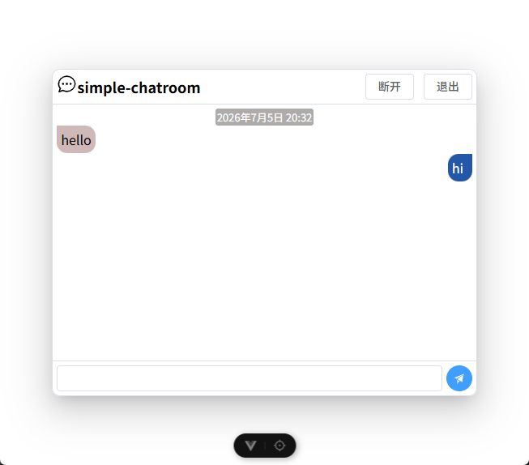

# simple-chatroom

一个支持文字聊天的网页

后端为[chat-server](https://github.com/LiZi35/chat-server)

## 截图



## 运行
使用 vscode 等编辑器编辑`.env.production`。例如：
```ini
# 后端的地址
VITE_API_BASE_URL=https://example.com:3000
```

安装依赖：
```shell
pnpm install
```
构建：
```shell
pnpm build
```
将生成的dist文件夹上传到web服务器并启动后端即可

## 其他
~~本项目主要为古法编程而成~~
